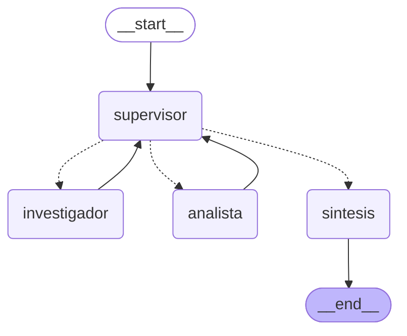

# 06 — Orquestador multi-agente especializado

Pre-entrega 6. Topología jerárquica en LangGraph: un supervisor que enruta, dos especialistas
con herramientas acotadas y una fase de síntesis final.

## Archivos

| Archivo | Contenido |
|---|---|
| `state.py` | `OrquestadorState` (hereda de `MessagesState`) con `next_agent`, `contribuciones`, `pasos` y `veredicto`. |
| `agents/research_agent.py` | Agente investigador: busca documentación y trae métricas crudas. |
| `agents/analyst_agent.py` | Agente analista: calcula estadísticas y evalúa el SLA. |
| `graph.py` | El supervisor, las aristas condicionales, el nodo de síntesis y el tope de pasos. |
| `main.py` | Demo por consola del flujo de delegación. Exporta `grafo.mmd`. |
| `demo.ipynb` | Notebook con el mismo flujo, paso a paso, más el diagrama. |
| `grafo.mmd` | Diagrama generado con `get_graph().draw_mermaid()`. |

## Cómo correrlo

Requiere **Python 3.12**.

```bash
python -m venv .venv
.venv\Scripts\activate          # Windows  (Linux/macOS: source .venv/bin/activate)
pip install -r requirements.txt
copy .env.example .env          # Linux/macOS: cp .env.example .env
python main.py
```

Para la demo interactiva: `jupyter lab demo.ipynb` (necesita `pip install jupyterlab`).

## Topología



Las aristas punteadas salen del supervisor: son las condicionales. `main.py` regenera este
diagrama en `grafo.mmd` en cada corrida.

### Por qué esta topología

Es **jerárquica en estrella**, no una cadena ni una red. Los especialistas nunca se hablan
entre sí: siempre devuelven el control al supervisor. Eso trae tres cosas concretas:

- **Una sola fuente de decisión.** Si el flujo sale mal, se mira un solo prompt (el del
  supervisor) en vez de reconstruir una negociación entre agentes.
- **Trazabilidad.** Cada delegación deja el motivo escrito en `veredicto`, así que la corrida
  se lee paso a paso.
- **Extensibilidad barata.** Agregar un tercer especialista es un nodo, una arista y una línea
  en la rúbrica. En una topología de todos-con-todos serían N conexiones nuevas.

El costo es que el supervisor es un cuello de botella: hay una llamada al modelo por cada
vuelta. Para dos especialistas se paga sin problema; con diez habría que agrupar dominios o
dejar que ciertos pares se comuniquen directo.

### Cómo se manejan los conflictos entre agentes

**Por especialización, antes que por negociación.** Las herramientas no se superponen: el
investigador **no puede** calcular (`obtener_metricas` devuelve los números crudos y lo dice en
su docstring) y el analista **no puede** buscar. Si sus conclusiones difieren, no es una
disputa de opiniones: uno tiene el dato y el otro el cálculo.

**Los desacuerdos se resuelven hacia arriba.** Al analista se le instruye que, si le falta un
dato, lo diga explícitamente en vez de estimarlo. El supervisor lee eso y devuelve la pelota al
investigador. Es el ciclo de refinamiento, y viaja por el estado compartido, no por un canal
entre agentes.

**El supervisor tiene la última palabra, pero acotada.** No puede pedir refinamientos
indefinidos: la rúbrica es de suficiencia, no de perfección, y hay un tope duro de pasos.

## Estado compartido

`contribuciones` es una lista con reducer `operator.add`: cada especialista agrega su aporte
en vez de pisar el anterior. Sirve para dos cosas.

Primero, el supervisor decide leyendo ese resumen y no todo el historial de mensajes, que
incluye llamadas a herramientas y resultados crudos.

Segundo, **contra la contaminación de contexto**: cada especialista recibe un briefing armado
—la tarea original más lo que aportaron los demás— y no el historial completo del sistema. No
ve los mensajes internos del supervisor ni las llamadas a herramientas de los otros agentes.

## Contra el supervisor infinito

Dos frenos, uno blando y uno duro:

1. **Rúbrica de suficiencia** en el prompt: tres condiciones concretas y la instrucción
   explícita de no pedir refinamientos cosméticos si ya se cumplen.
2. **Tope de pasos** (`MAX_PASOS = 6`), chequeado en código antes de consultar al modelo. Al
   alcanzarlo se fuerza `FINISH` y se sintetiza con lo que haya. Esto no depende de que el
   modelo se porte bien, que es el punto.

## Flujo esperado

```
[supervisor] -> investigador   (faltan las métricas y el umbral del SLA)
[investigador] busqueda: muestras [320, 410, 380, 520, ...]. SLA: p95 <= 300 ms.
[supervisor] -> analista       (ya están los datos crudos, falta procesarlos)
[analista]  p95=520 ms contra un SLA de 300 ms: incumple por 220 ms; hay que bajarlo 42%.
[supervisor] -> FINISH         (rúbrica cumplida: datos, cálculo y conclusión)
[sintesis]  El servicio de búsqueda es el peor: p95 de 520 ms contra un SLA de 300 ms...
```

La consulta está elegida para que ningún especialista pueda resolverla solo: hace falta buscar
(SLA + métricas) y después calcular (percentil + brecha). El supervisor delega al menos dos
veces antes de poder cerrar.

## Nota sobre la verificación

El grafo, los nodos, las aristas condicionales, las herramientas y el tope de pasos se
probaron con un modelo guionado, sin llamadas a la API. Lo que **no** está verificado es si un
modelo real aplica bien la rúbrica del supervisor. Corré `python main.py` con tus claves para
comprobar eso.
