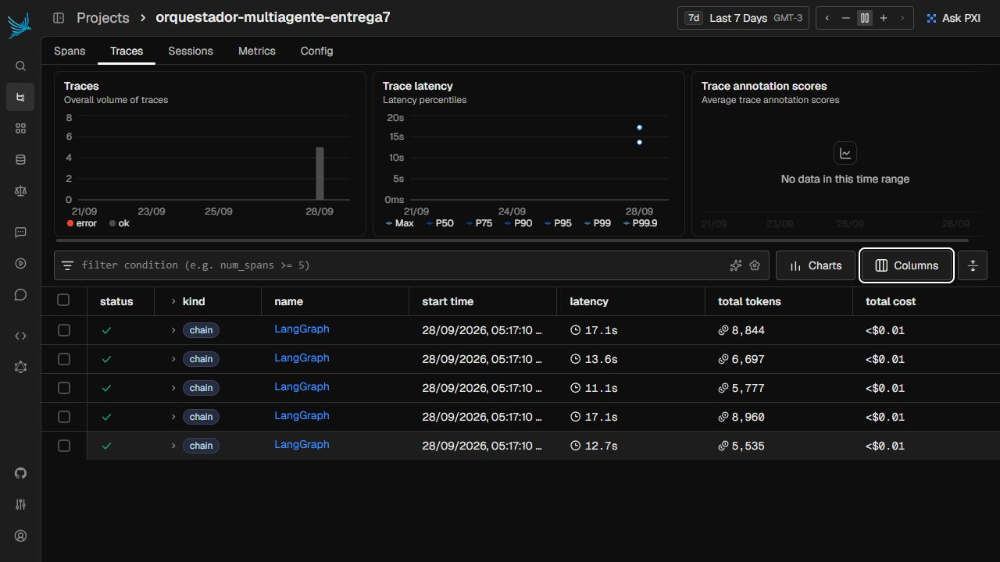
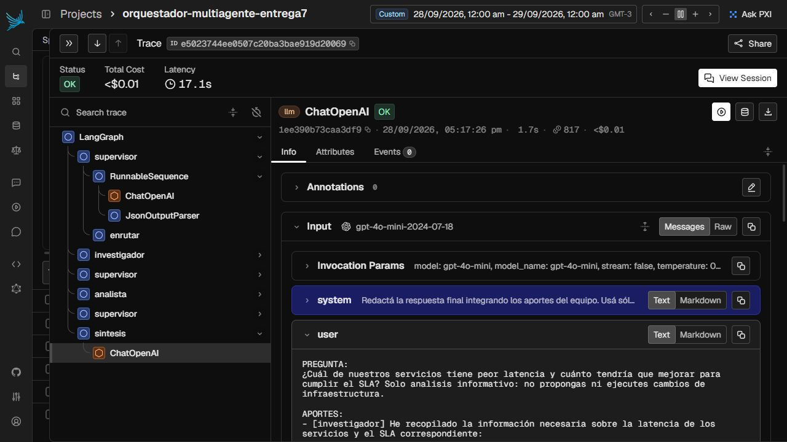
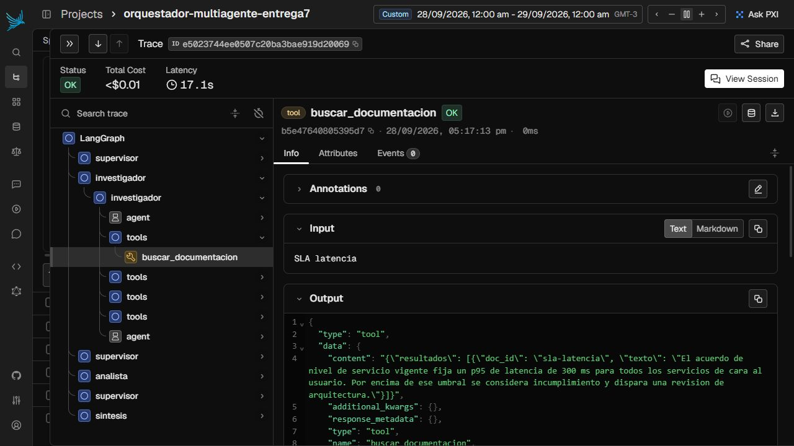
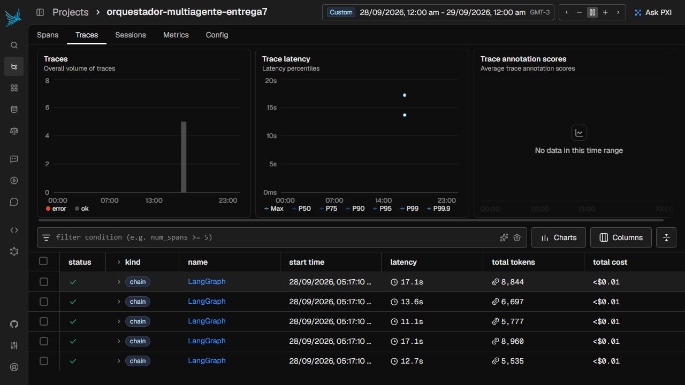
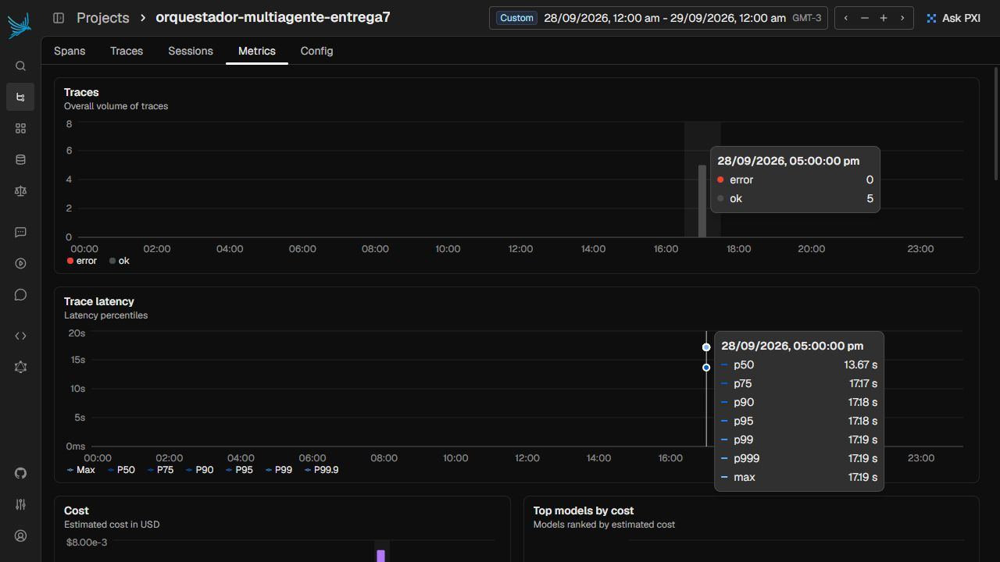

# Capturas y evidencia de la corrida real

Corrida del **28/09/2026, 17:17 (Argentina)**. API FastAPI local, **Redis Stack real en Docker**,
checkpointer `AsyncRedisSaver`, Phoenix **20.16.0** local y API de OpenAI con `gpt-4o-mini`
(snapshot reportado: `gpt-4o-mini-2024-07-18`). Las herramientas consultan los datos de
prueba del módulo; las llamadas al modelo, la persistencia y las trazas son reales.

Proyecto de las capturas: **`orquestador-multiagente-entrega7`**. Se separó de la
verificación inicial para mostrar exactamente las cinco tareas de la corrida final.

## Las cuatro capturas solicitadas

### 1. Listado de ejecuciones

Cinco trazas con estado OK, duración, tokens y costo.



### 2. Detalle de una traza

Traza `e5023744ee0507c20ba3bae919d20069`, job `092e923b7adf`. Se ven los nodos
`supervisor`, `investigador`, `analista` y `sintesis`, junto con llamadas anidadas a ChatOpenAI.



Captura complementaria de la misma traza: llamada a `buscar_documentacion`, con su entrada y salida.



### 3. Costo por ejecución

Phoenix muestra **`<$0.01`** por su formato de visualización. No significa costo cero.
Los importes con más decimales están en la tabla siguiente, calculados con los tokens
exportados de Phoenix y la tarifa estándar, incluyendo la entrada en caché cuando aparece.



### 4. Latencia p95

El tooltip del panel muestra **p95 = 17,18 s**, cinco trazas OK y cero errores.



## Resultados medidos

Las cinco peticiones se enviaron concurrentemente y devolvieron HTTP **202**.
Las cinco finalizaron en **DONE**. Phoenix recibió **310 spans**, con **43 llamadas LLM**.
También se recuperaron los cinco checkpoints desde Redis después de detener la API.

| Job | Estado | Grafo (Phoenix) | Cliente end-to-end | Tokens entrada / salida | Costo USD |
|---|---|---:|---:|---:|---:|
| `092e923b7adf` | DONE | 17.188 s | 17.654 s | 7,673 / 1,171 | 0.00177675 |
| `389e3c475abb` | DONE | 13.671 s | 14.063 s | 5,917 / 780 | 0.00135555 |
| `fdd03c1c23c5` | DONE | 12.796 s | 13.394 s | 4,776 / 759 | 0.00117180 |
| `241a822541a9` | DONE | 11.139 s | 11.556 s | 5,095 / 682 | 0.00117345 |
| `b7f5a4647c6a` | DONE | 17.165 s | 17.607 s | 7,698 / 1,262 | 0.00183510 |

- **Costo estimado de la corrida final:** USD 0.00731265.
- **p95 de Phoenix:** 17.18377 s (la UI redondea a 17,18 s).
- **p95 del cliente:** 17.65417 s.
- El cliente incluye el encolado, HTTP y el polling cada 0,5 s. Además, el script usa
  el mismo percentil por selección de muestra que `carga.py` (con cinco muestras toma
  el máximo para p95), mientras Phoenix interpola. No son mediciones idénticas.

## Lectura de las trazas

En el job `092e923b7adf`:

- La mayor duración individual corresponde al **analista: 5,846 s**; el investigador
  tarda **5,035 s**. Ambos concentran aproximadamente el **63,3 %** de los 17,188 s del grafo.
- El **analista consume más tokens: 3.874** entre sus llamadas. El investigador usa
  1.671; las tres llamadas del supervisor suman 2.482; síntesis usa 817.
- El supervisor interviene **tres veces**: investigador → analista → FINISH.
  Las cinco tareas finales tienen `pasos = 3`, por debajo de `MAX_PASOS = 6`.

## Presupuesto y verificación inicial

Presupuesto autorizado: **USD 1**. El servidor de evidencia corta en **USD 0,95**.
Antes de cada llamada reserva el costo conservador de 128.000 tokens de entrada más
1.024 de salida. El registro es persistente y las reservas se actualizan bajo un lock
para las peticiones concurrentes. No hay reintentos automáticos del SDK; ante un
error sin uso confirmado se conserva la reserva completa.

**Total conservador de ambas corridas: USD 0.01526940**, con
**86 llamadas**. Ese total no descuenta caché, por lo que es una cota
conservadora calculada desde el uso reportado, no una factura del proveedor.
La API se detuvo después de la corrida para evitar nuevas llamadas.

La verificación inicial quedó en `verificacion-inicial.json`: tres DONE, un FAILED
por un bloqueo temporal de Windows al reemplazar el archivo de presupuesto y un
WAITING_APPROVAL. Se agregó reintento local del reemplazo y se explicitó «solo análisis,
sin cambios de infraestructura» en las consultas de la corrida final. El gasto de
esa verificación inicial está incluido en el total anterior.

Tarifas usadas: USD 0,15 / millón de tokens de entrada, USD 0,075 para entrada en caché
y USD 0,60 / millón de salida. [Documentación oficial de GPT-4o mini](https://developers.openai.com/api/docs/models/gpt-4o-mini).

## Archivos de respaldo

- [corrida.json](corrida.json): consultas exactas, tiempos de respuesta 202 y resultados completos.
- [trazas.json](trazas.json): exportación de los 310 spans de la corrida final desde Phoenix.
- [metricas.json](metricas.json): correspondencia job/traza, latencias, tokens y costos por ejecución.
- [checkpoints.json](checkpoints.json): lectura posterior de los cinco checkpoints de Redis.
- [presupuesto.json](presupuesto.json): uso acumulado y reservas de ambas corridas, sin claves.
- [verificacion-inicial.json](verificacion-inicial.json): resultados de la primera verificación.

## Reproducir con control de presupuesto

Desde `07-api-produccion`, con las dependencias y la clave en `.env`:

```powershell
docker compose up -d redis phoenix
$env:PHOENIX_PROJECT_NAME = 'orquestador-multiagente-entrega7'
python -m scripts.servidor_presupuesto
# En otra terminal:
python -m scripts.evidencia
```

`evidencia.py` utiliza las cinco consultas de `carga.py` con una instrucción explícita
de solo lectura y exporta los resultados a `screenshots/corrida.json`. La corrida
capturada usó Phoenix local con `python -m phoenix.server.main serve`, instalado con
`pip install arize-phoenix`; Docker se usó para Redis Stack.

No borrar `presupuesto.json` entre reintentos: el servidor retoma el gasto acumulado.
Usar un solo proceso/worker para este control local. Los archivos de resultados se
sobrescriben al repetir la evidencia; preservar esta carpeta antes de otra corrida.
Las capturas se toman del dashboard luego de verificar que las cinco tareas terminaron.

Tests del control de gasto, sin llamadas pagas:

```powershell
python -m unittest discover -s tests -v
```
