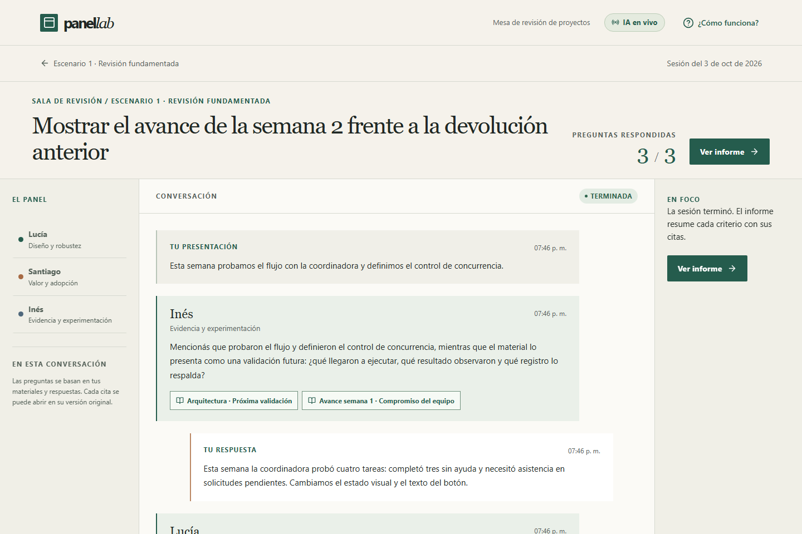
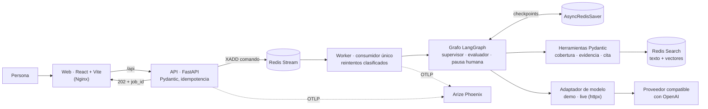
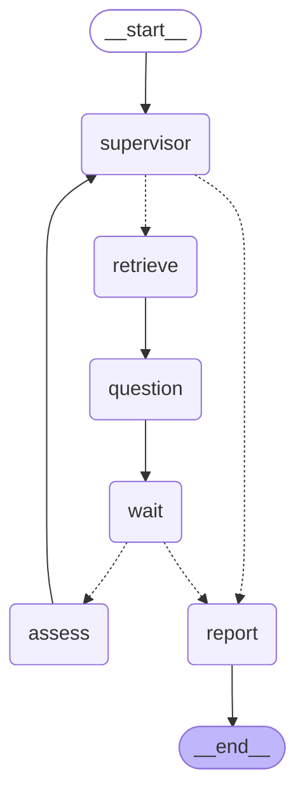
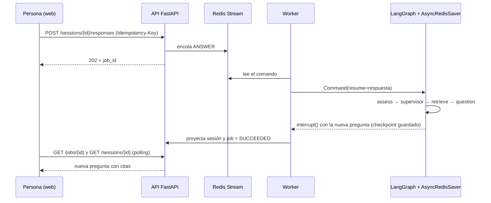

# PanelLab — Sistema Intelligence (entrega final)

PanelLab es un **panel de evaluadores con IA para ensayar la defensa de un proyecto**. Cargás tus
documentos, elegís evaluadores y una rúbrica, y respondés por turnos las preguntas que el panel
formula **citando fragmentos de tus propios documentos**. Al final recibís un informe por criterio
que distingue lo probado de lo planificado. Una sesión posterior puede compararse con la anterior.

Integra en un único flujo las capas del curso: **cliente asíncrono de LLM** (módulos 1–2), **RAG
híbrido con citas verificables** (3–4), **agentes con supervisor, herramientas y pausa humana** (5–6)
y **API de producción con Redis, worker y trazas en Arize Phoenix** (7).



## Arranque en un comando

Requisitos: Docker con Compose y los puertos `8080` y `6007` libres.

```sh
docker compose up --build -d
```

| Servicio | URL |
| --- | --- |
| Aplicación web | http://127.0.0.1:8080 |
| API documentada (OpenAPI / Swagger) | http://127.0.0.1:8080/api/docs |
| Arize Phoenix (trazas) | http://127.0.0.1:6007 |
| Salud del sistema | http://127.0.0.1:8080/api/health/ready |

Arranca en **modo demo**: el modelo se reemplaza por un adaptador determinista, así se recorre el
flujo completo **sin clave ni costo**. En un proyecto nuevo, el botón **Usar ejemplo de Laboratorio 3**
carga un caso ficticio. Para usar un modelo real (OpenAI) ver [Modo live](#modo-live).

También hay un script con los comandos frecuentes (en Windows, desde Git Bash):
`./run.sh up | live | test | smoke | scenarios | graph | logs | down`.

## Cómo responde a la consigna

| Requisito de la entrega | Implementación | Dónde verificarlo |
| --- | --- | --- |
| 1. Integrar M6 y M7 en una estructura unificada | Supervisor + evaluadores especialistas (M6) dentro de una API FastAPI con Redis, worker, Phoenix y pausa humana (M7), en un solo repo con backend, frontend y Compose. | [Arquitectura](#arquitectura), [`backend/app/`](backend/app) |
| 2. Comunicación asíncrona con LLMs y bases | `httpx.AsyncClient` para el proveedor, `redis.asyncio`, `AsyncRedisSaver`, nodos `async` y `ainvoke`. Ruff con reglas `ASYNC` no reporta llamadas bloqueantes. | [`llm.py`](backend/app/llm.py), [`engine.py`](backend/app/engine.py) |
| 3. Checkpointer: las conversaciones sobreviven al reinicio | `AsyncRedisSaver` con `thread_id` estable por sesión; la pausa usa `interrupt()` y no ocupa al worker mientras espera. | Escenario 4 y test `test_session_survives_new_engine_instance` |
| 4. Pydantic en entradas/salidas de la API y de las herramientas | Todas las rutas tienen modelo de entrada y `response_model` (`extra="forbid"`). Las tres herramientas de los agentes son `StructuredTool` con `args_schema` y salida validada. Las salidas del LLM se validan con esquemas estrictos. | [`contracts.py`](backend/app/contracts.py), [`tools.py`](backend/app/tools.py) |
| 5. Al menos 5 pruebas con trazas en Phoenix | Batería de 5 escenarios end-to-end contra el modelo real, cada uno agrupado como sesión en Phoenix, con tokens y costo. | [Evidencia](#evidencia-cinco-escenarios-con-el-modelo-real) |
| 6. README con diagrama del grafo de agentes | Diagrama **generado desde el grafo compilado** (no dibujado a mano). | [Grafo de agentes](#grafo-de-agentes) |
| 7. Despliegue local con una instrucción | `docker compose up --build -d` levanta web, API, worker, Redis Stack y Phoenix. | [Arranque](#arranque-en-un-comando) |

## Arquitectura



Cinco contenedores: `web`, `api`, `worker`, `redis` (Redis Stack: datos, búsqueda, stream y
checkpoints, con AOF en un volumen) y `phoenix`. Sólo la web y Phoenix se publican, en `127.0.0.1`.

### Cómo se integran las capas del curso

| Capa | Pre-entrega de origen | Cómo vive en el sistema | Código |
| --- | --- | --- | --- |
| Cliente de LLM asíncrono | M1 (cliente unificado async) | Adaptador `demo`/`live` sobre `httpx.AsyncClient`, URL configurable, reintento ante 429/5xx que el proveedor no factura, presupuesto con reservas atómicas en Redis. | [`llm.py`](backend/app/llm.py) |
| Salida estructurada y validación | M2 (LCEL + Pydantic + reintentos) | Cada decisión del modelo es un esquema Pydantic estricto (JSON Schema `strict`); los IDs de citas se restringen con `enum` a los fragmentos recuperados en ese turno. `RetryPolicy` reintenta una salida inválida. | [`engine.py`](backend/app/engine.py) |
| RAG con persistencia | M3 (RAG local) | Chunking por sección y página, embeddings y metadatos (documento, versión, sección) persistidos en Redis. Cada cita se verifica contra el texto almacenado. | [`rag.py`](backend/app/rag.py) |
| Recuperación híbrida | M4 (BM25 + vectorial con Ensemble) | Búsqueda léxica y KNN vectorial en **Redis Search**, fusionadas con Reciprocal Rank Fusion, filtradas por proyecto y por las versiones congeladas en la sesión. | [`rag.py`](backend/app/rag.py) |
| Agente con herramientas y memoria | M5 (ReAct + checkpointer) | `StateGraph` cíclico con herramientas `StructuredTool` y `AsyncRedisSaver`: la sesión se retoma desde su checkpoint. | [`engine.py`](backend/app/engine.py), [`tools.py`](backend/app/tools.py) |
| Supervisor multi-agente | M6 (supervisor + especialistas) | El supervisor elige qué evaluador pregunta y sobre qué criterio; cinco perfiles especialistas editables en Markdown; tope de preguntas como freno. | [`engine.py`](backend/app/engine.py), [`config/profiles/`](config/profiles) |
| API, cola, HITL y trazas | M7 (FastAPI + Redis + Phoenix + HITL) | Comandos largos devuelven `202` y un `job_id`; un worker los ejecuta desde un Redis Stream; `interrupt()` espera la respuesta de la persona; spans OpenInference en Phoenix. | [`main.py`](backend/app/main.py), [`worker.py`](backend/app/worker.py), [`observability.py`](backend/app/observability.py) |

## Grafo de agentes

Diagrama generado con `graph.get_graph().draw_mermaid()` a partir del grafo compilado
(`docker compose exec api python -m scripts.export_graph`). Las aristas punteadas son condicionales.



| Nodo | Rol | Herramientas y validación |
| --- | --- | --- |
| `supervisor` | Decide qué evaluador interviene y sobre qué criterio, o cierra la sesión. Redacta la consulta de búsqueda. | `evaluar_cobertura` calcula los pares evaluador/criterio válidos; el modelo elige dentro de esa lista (`SupervisorDecision`). |
| `retrieve` | Busca evidencia para el criterio elegido. Si la consulta del supervisor no encuentra nada, reintenta con una consulta derivada del criterio. | `buscar_evidencia` (RAG híbrido, alcance fijado por el servidor). |
| `question` | El evaluador seleccionado formula una pregunta en su voz, citando fragmentos. | `ReviewerQuestion` con `enum` de fragmentos; `verificar_cita` comprueba cada cita contra el original. |
| `wait` | **Pausa humana**: `interrupt()` guarda el checkpoint y espera la respuesta o el cierre de la persona. | Valida que la respuesta apunte a la pregunta pendiente (`question_id`, revisión esperada). |
| `assess` | Valora la respuesta según la rúbrica y calibra: un plan citado nunca cuenta como resultado ejecutado. | `AnswerAssessment` + calibración determinista. |
| `report` | Informe por criterio (`supported`, `partial`, `missing`, `not_assessed`), fortalezas, próximos pasos y comparación con la sesión anterior. | `Report` (Pydantic). |

Reglas de turno: cada evaluador seleccionado habla al menos una vez antes de que otro repita, y el
supervisor no puede cerrar antes de esa primera ronda (salvo que la persona termine la sesión).

### Recorrido de un turno



## Robustez técnica: asincronía y validación

- **Todo el I/O es asíncrono**: proveedor de LLM y embeddings con `httpx.AsyncClient`; Redis con
  `redis.asyncio`; checkpoints con `AsyncRedisSaver`; el grafo se ejecuta con `ainvoke`. La extracción
  de PDF (CPU) corre en un proceso aparte vía `asyncio.to_thread`. `ruff check` con la familia de
  reglas `ASYNC` pasa sin avisos.
- **Pydantic en cada frontera**: cuerpos y respuestas de la API (`extra="forbid"`), configuración
  (`pydantic-settings`), argumentos y salidas de las herramientas, decisiones del modelo (JSON Schema
  estricto) y Markdown de perfiles y rúbricas (frontmatter YAML validado).
- **Fallas previstas**: idempotencia por `Idempotency-Key` y revisión esperada en todos los
  comandos; el worker clasifica errores (transitorios reintentables vs. permanentes como clave
  inválida o falta de crédito) y sobrevive a una caída momentánea de Redis; una salida inválida del
  modelo se reintenta con `RetryPolicy`; una llamada rechazada libera su reserva de presupuesto.

## Persistencia y observabilidad

- **Checkpointer**: cada sesión es un hilo de LangGraph (`thread_id = panellab:<session_id>`) guardado
  en Redis Stack con AOF. La pregunta pendiente, el transcript y el estado del grafo sobreviven a
  reiniciar API y worker (escenario 4) y a recrear la instancia del motor (test de integración).
- **Trazas en Phoenix**: spans con convenciones OpenInference — `CHAIN` por comando y por nodo del
  grafo, `TOOL` por herramienta, `RETRIEVER` con los fragmentos devueltos y `LLM` con mensajes, tokens
  y costo. Las trazas se agrupan por `session.id`, y el span raíz de cada comando registra lo que dijo
  la persona y lo que devolvió el panel: en la vista **Sessions** de Phoenix cada sesión se lee como una
  conversación. Las lecturas de polling no se trazan, para que no tapen lo importante. En demo también se emiten spans `LLM` (modelo
  `demo-determinista`, costo cero), de modo que la forma de la traza es la misma en ambos modos.

## Evidencia: cinco escenarios con el modelo real

`backend/scripts/scenarios.py` ejecuta cinco sesiones end-to-end contra la API real. Resultado de
la corrida con `gpt-6-luna` en el proyecto de Phoenix `panellab-cinco-escenarios`
([detalle completo](evidence/scenarios-live.json), [capturas y lectura](evidence/README.md)):

| # | Escenario | Qué verifica | Resultado | Costo (USD) |
| --- | --- | --- | --- | ---: |
| 1 | Revisión fundamentada | Los tres evaluadores intervienen; cada cita se comprueba textualmente contra el original. | OK · 8 citas verificadas | 0,0034 |
| 2 | Evidencia insuficiente | Afirmaciones sin respaldo documental no quedan como evidencia sustentada. | OK · `evidencia: missing` | 0,0027 |
| 3 | Seguimiento semanal | Nueva versión de avance y comparación criterio por criterio con la sesión anterior. | OK | 0,0036 |
| 4 | Reinicio con pausa | Se reinician API y worker con una pregunta pendiente; el checkpoint la recupera intacta. | OK | 0,0032 |
| 5 | Validación y cierre | 422 ante entradas inválidas, 409 ante revisión vieja, idempotencia y cierre anticipado. | OK | 0,0005 |
| | **Total** | | **5/5** | **0,0134** |

En Phoenix (proyecto `panellab-evidencia`): **292 spans, 62 trazas, 5 sesiones** — 55 spans `TOOL`,
38 `LLM` (93.517 tokens), 13 `RETRIEVER` y 39 `EMBEDDING`; latencia p95 por comando 16,1 s. El único
span en error muestra la resiliencia: el modelo repitió una cita, la validación rechazó el intento y
el `RetryPolicy` lo reintentó con éxito.


## API

Base `/api`, documentada en `/api/docs`. Los comandos que crean, responden, finalizan o reintentan
exigen `Idempotency-Key`: repetir la clave con el mismo cuerpo devuelve el acuse original; con otro
cuerpo, `409`. Los comandos largos responden `202` con un `job_id`.

| Método y ruta | Uso |
| --- | --- |
| `POST/GET /projects`, `GET/PATCH /projects/{id}` | Crear, listar, ver, editar o archivar proyectos (`?archived=true` lista los archivados). |
| `POST/GET /projects/{id}/documents`, `POST …/documents/extract` | Cargar materiales (texto o PDF con vista previa) e indexarlos. |
| `GET/POST /projects/{id}/profiles`, `GET/POST /projects/{id}/rubrics` | Evaluadores y rúbricas en Markdown versionado. |
| `POST/GET /projects/{id}/sessions`, `GET /sessions/{id}` | Iniciar una sesión (snapshot inmutable de versiones) y consultar su estado. |
| `POST /sessions/{id}/responses`, `POST /sessions/{id}/finish` | Responder la pregunta pendiente o terminar. |
| `GET /sessions/{id}/report` | Informe por criterio. |
| `GET /jobs/{id}`, `POST /jobs/{id}/retry` | Estado de un comando y reintento explícito. |
| `GET /health/live`, `GET /health/ready` | Salud del proceso y de Redis, worker y Phoenix. |

## Verificación

| Comprobación | Comando | Resultado |
| --- | --- | --- |
| Tests backend (incluye Redis Search y checkpointer reales) + estilo y reglas `ASYNC` | `./run.sh test` | 55 aprobados; Ruff sin avisos |
| Tests frontend, tipos y build | `cd frontend && npm test && npm run typecheck && npm run build` | 88 aprobados; sin errores de tipos ni de build |
| Smoke contra la API (demo) | `docker compose exec api python -m scripts.smoke --url http://localhost:8000` | 10 comprobaciones, 3 citas verificadas |
| Cinco escenarios end-to-end | `./run.sh scenarios` | 5/5 en demo y en live |
| Clon limpio sin `.env` + `docker compose up --build -d` | — | arranca en demo; smoke y tests OK |

`./run.sh test` levanta un Redis desechable (perfil `test` de Compose) para los tests de
integración, así no tocan los datos de la aplicación. Sin `PANEL_TEST_REDIS_URL` esos tres tests
se omiten y el resto corre igual (`docker compose exec api python -m pytest -q`).

## Configuración

Toda la configuración se lee de variables de entorno con prefijo `PANEL_`
([`config.py`](backend/app/config.py)); `.env` es opcional y nunca se sube (está en `.gitignore`).
Los valores por defecto están en [`.env.example`](.env.example).

| Variable | Por defecto | Uso |
| --- | --- | --- |
| `PANEL_LLM_MODE` | `demo` | `demo` (determinista, sin red) o `live`. |
| `PANEL_OPENAI_API_KEY` | — | Clave del proveedor; sólo la leen API y worker. |
| `PANEL_LLM_BASE_URL` | `https://api.openai.com/v1` | Cualquier API compatible con OpenAI. |
| `PANEL_CHAT_MODEL` / `PANEL_EMBEDDING_MODEL` | `gpt-6-luna` / `text-embedding-3-small` | Modelos con tarifa verificada en `llm.py`. |
| `PANEL_RAG_INDEX` | `panellab:chunks` | Nombre del índice de Redis Search. |
| `PANEL_BUDGET_CAP_USD` | `0.95` | Techo de gasto acumulado del modo live. |
| `PANEL_PHOENIX_PROJECT` | `panellab` | Proyecto de Phoenix donde llegan las trazas. |
| `PANEL_TRACE_CONTENT` | `true` | `false` omite prompts y fragmentos en las trazas. |

Python 3.12 en las imágenes y en `requires-python`; dependencias declaradas en
[`pyproject.toml`](backend/pyproject.toml) y fijadas en [`requirements.lock`](backend/requirements.lock);
el frontend usa `package-lock.json`.

## Modo live

1. Crear `.env` a partir de `.env.example` y completar `PANEL_OPENAI_API_KEY`.
2. Levantar con la base live (separada de la demo, con su propio ledger de presupuesto):

```sh
docker compose -f compose.yaml -f compose.live.yaml up --build -d
```

Detalles, tarifas y presupuesto en [docs/live.md](docs/live.md).

## Estructura

```
08-entrega-final/
├── backend/
│   ├── app/            FastAPI, grafo, herramientas, RAG, adaptador de modelo, worker, trazas
│   ├── scripts/        smoke, escenarios, prueba de reinicio, exportación del grafo
│   └── tests/          55 tests (unitarios + integración con Redis)
├── frontend/           React 19 + Vite + TanStack Query, servido por Nginx
├── config/             evaluadores y rúbrica en Markdown (plantillas de cada proyecto)
├── demo/laboratorio3/  caso ficticio para el modo demo
├── docs/               arquitectura, modo live, PDF, evaluadores, revisión de UX, grafo.mmd
├── evidence/           corridas, trazas y capturas
├── compose.yaml        stack completo (demo)
└── compose.live.yaml   override para el modo live
```

## Límites conocidos

- Pensado para uso local: no tiene autenticación ni aislamiento entre usuarios.
- Un solo worker procesa la cola (suficiente para el caso de uso; el diseño con grupos de
  consumidores admite más).
- PDF sólo con texto seleccionable (sin OCR), hasta 10 MiB y 50 páginas.
- Las preguntas y valoraciones del modo demo verifican el circuito, no la calidad de un modelo.
