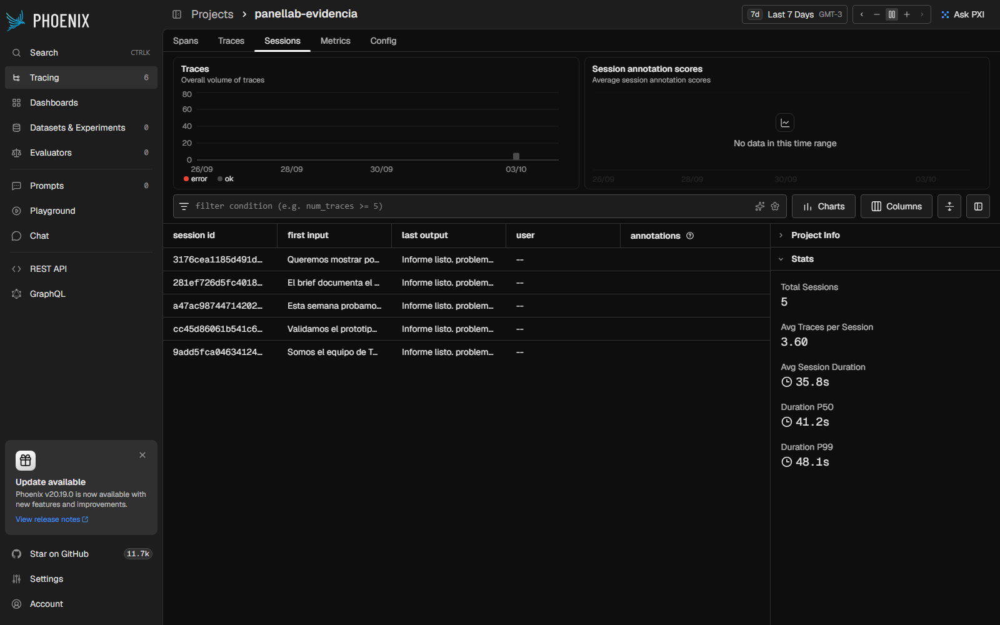
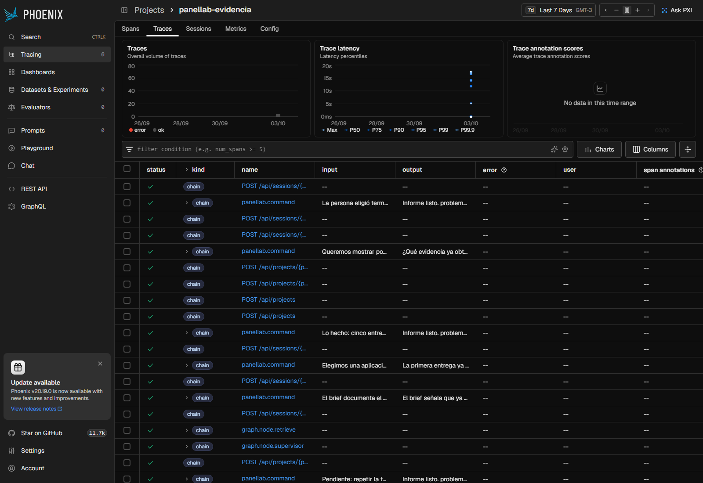
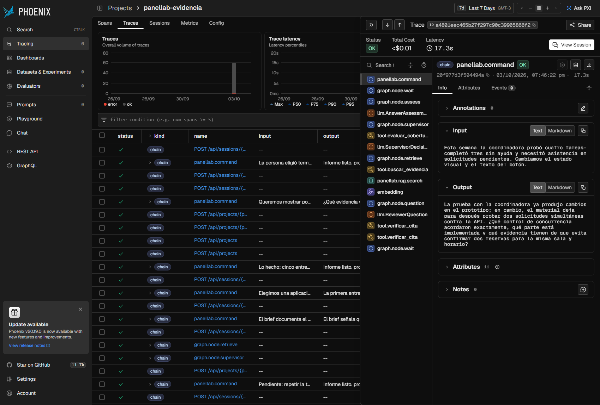
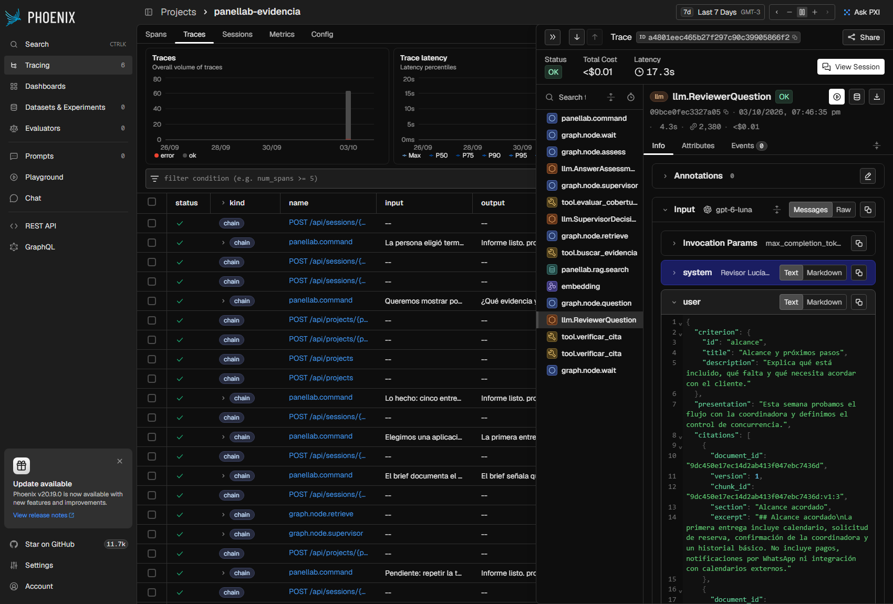
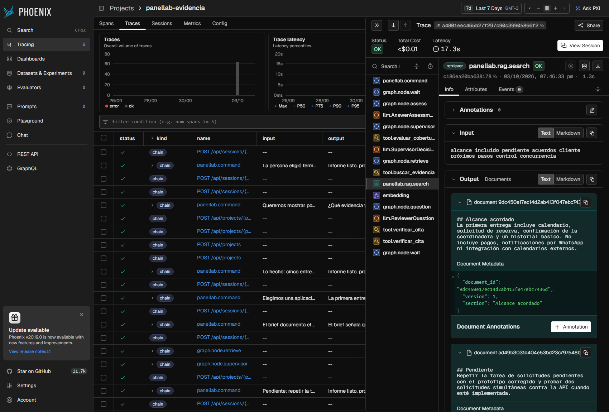
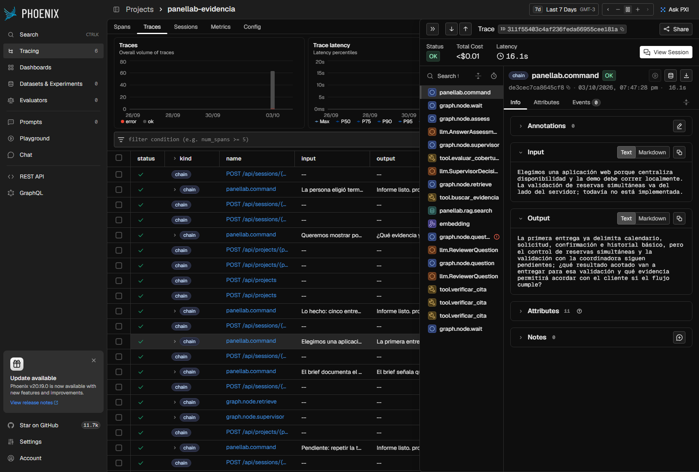

# Evidencia — entrega final (03/10/2026)

Stack completo en Docker Compose (web, API, worker, Redis Stack y Arize Phoenix 20.16) en modo
**live** con `gpt-6-luna` y `text-embedding-3-small`. Las respuestas de la persona las redacta el
script de prueba sobre el caso ficticio de `demo/laboratorio3`; las preguntas, valoraciones e
informes los generó el modelo. Ningún archivo de esta carpeta contiene claves.

## Cinco escenarios end-to-end

Comando: `python backend/scripts/scenarios.py --redis-service redis-live` (con `compose.live.yaml`).
Resultado completo: [scenarios-live.json](scenarios-live.json).

| # | Escenario | Qué verifica | Resultado | Duración | Costo (USD) |
| --- | --- | --- | --- | ---: | ---: |
| 1 | Revisión fundamentada | Con el material completo, los tres evaluadores intervienen y sus preguntas citan fragmentos que se comprueban textualmente contra los originales. | OK · 3 preguntas, 8 citas verificadas | 61,5 s | 0,003441 |
| 2 | Evidencia insuficiente | Con sólo un plan documentado y respuestas que afirman avances sin respaldo, el informe no da por sustentada la evidencia. | OK · `evidencia: missing` | 41,5 s | 0,002747 |
| 3 | Seguimiento semanal | Nueva versión de avance + referencia al informe anterior: el informe compara criterio por criterio. | OK · comparación con la sesión 1 | 52,9 s | 0,003590 |
| 4 | Reinicio con pausa | Con una pregunta pendiente se reinician API y worker; la pregunta y el transcript se recuperan del checkpoint y la sesión continúa. | OK · estado idéntico tras reiniciar | 49,2 s | 0,003199 |
| 5 | Validación y cierre | Pydantic rechaza entradas inválidas (422), la revisión desactualizada da 409, la idempotencia devuelve el mismo trabajo y el cierre anticipado deja criterios "no evaluado". | OK · 422, 422, 422, 409 | 7,0 s | 0,000458 |
| | **Total** | | **5/5** | | **0,013434** |

El costo sale del ledger de presupuesto del sistema (uso informado por el proveedor × tarifa).
Los spans LLM de Phoenix suman **USD 0,013193** con 83.914 tokens de entrada y 9.603 de salida en
38 llamadas; la diferencia corresponde a los embeddings.

## Trazas en Arize Phoenix

Proyecto `panellab-evidencia`: **292 spans en 62 trazas, agrupadas en 5 sesiones**.

| Tipo de span | Cantidad | Qué representa |
| --- | ---: | --- |
| `CHAIN` | 147 | Comandos HTTP (39), comandos del worker (23) y nodos del grafo |
| `TOOL` | 55 | `verificar_cita` (29), `buscar_evidencia` (13), `evaluar_cobertura` (13) |
| `LLM` | 38 | Decisiones del supervisor, preguntas y valoraciones |
| `EMBEDDING` | 39 | Indexación de documentos y consultas |
| `RETRIEVER` | 13 | Búsqueda híbrida con los fragmentos devueltos |

Latencia por comando del worker: p50 6,6 s · p95 16,1 s · máx. 17,4 s. Las lecturas de polling no
se trazan, así que la lista sólo muestra trabajo real.

**Un span en ERROR, y es la resiliencia funcionando**: en un turno el modelo repitió el ID de una
cita; la validación rechazó el primer intento del nodo `question` y el `RetryPolicy` lo reintentó
con éxito (traza `311f55403c4af236feda66955cee181a`, captura 6).

### Capturas

1. **Sesiones** — cada sesión como conversación: la presentación de la persona y el informe final.
   
2. **Trazas** — comandos HTTP con nombre por ruta y comandos del worker con su entrada y salida.
   
3. **Un turno completo** (`ANSWER`): valoración, supervisor con `evaluar_cobertura`, búsqueda con
   `buscar_evidencia` y embeddings, pregunta del evaluador y `verificar_cita`.
   
4. **Span LLM** — modelo, tokens, costo, parámetros y mensajes.
   
5. **Span RETRIEVER** — consulta y fragmentos recuperados con sus metadatos.
   
6. **Reintento automático** ante una salida inválida del modelo.
   

## Interfaz

Capturas del stack live con los datos de la corrida (las de móvil, con emulación de dispositivo a
375 px; las cinco pantallas principales se verificaron sin desplazamiento horizontal).

| Pantalla | Captura |
| --- | --- |
| Proyectos | [ui-01-proyectos.png](screenshots/ui-01-proyectos.png) |
| Espacio de trabajo | [ui-02-proyecto.png](screenshots/ui-02-proyecto.png) |
| Sala de revisión (sesión de seguimiento) | [ui-03-sala.png](screenshots/ui-03-sala.png) |
| Informe con comparación semanal | [ui-04-informe.png](screenshots/ui-04-informe.png) |
| ¿Cómo funciona? | [ui-05-ayuda.png](screenshots/ui-05-ayuda.png) |
| Sala en móvil | [ui-06-sala-movil.jpg](screenshots/ui-06-sala-movil.jpg) |
| Informe en móvil | [ui-07-informe-movil.jpg](screenshots/ui-07-informe-movil.jpg) |

## Verificación automatizada

| Comprobación | Resultado |
| --- | --- |
| Tests backend (`./run.sh test`), incluidas integraciones con Redis Search y `AsyncRedisSaver` | 55 aprobados |
| Ruff (`check` + `format --check`, con reglas `ASYNC`) | sin avisos |
| Tests frontend (Vitest) | 88 aprobados |
| `npm run typecheck`, `npm run build`, `prettier --check` | sin errores |
| Smoke en modo demo contra la API real | 10 comprobaciones, 3 citas verificadas |
| Clon limpio (sólo los archivos que versiona git, sin `.env`) + `docker compose up --build` | arranca en demo; smoke y 55 tests OK dentro del contenedor |

## Historial

Evidencia de la primera versión (28/09/2026), conservada como registro: primera sesión live con
`gpt-4o-mini` ([first-live.json](first-live.json)), verificación del modelo `gpt-6-luna`
([luna-model-check.json](luna-model-check.json)), smoke y reinicio en demo
([smoke-docker-demo.json](smoke-docker-demo.json), [restart-docker-demo.json](restart-docker-demo.json))
y capturas de la interfaz anterior al rediseño en [screenshots/historico](screenshots/historico).
